# Music Theory for Computer Musicians Notes

# 第1章 音乐

音乐三大要素：

1. 音色（Tone Quality or Timbre）
2. 音调（Pitch）
3. 音量（Amplitude or Intensity）

# 第2章 The Notes

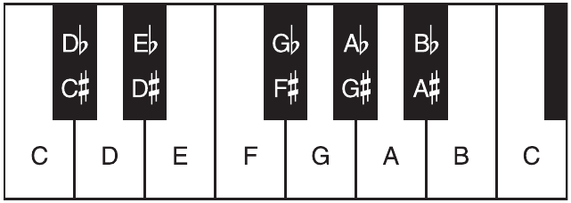

上图中：

1. Db后面的 b 称之为 flat，b意味着该键是通过把D降低半音得到的，全称叫 “D flat”，也可以记作 “Db”。其它的 Eb Gb Ab Bb 也是如此。
2. C# 后面的 # 称之为 sharp，# 意味着该键是把 C 升高半音得到的，全程叫 “C sharp”，也可以记作”C#”。其它的 D# F# G# A# 也是如此。
3. 在每个调式（Scale）内，每个字母只允许出现一次，也就是不可能同时出现 C C# D 这样的情况。

# 第3章 Major Scale

## Scale（调式）的种类

Majro Scale, Minor Scale, Chromatic Scale 常见于西方经典以及流行乐曲里。
Pentatonic Scale 常见于 folk 和舞曲里。
Microtonal Scales 常见于近远西方。
Modal Scales 常见于folk、popular、experimental rock和 dance 音乐。
Octatonic Scale 和 Hexatonic Scale 常被用作 Major Scale 和 Minor Scale 的变种，
Exotic Scales （外来调式）也经常用于创作出不寻常的气氛的音乐。

## Key（根音）

Key在一个Scale的起始位置。比如 do re mi fa so la ti 里的 do 就是这个scale的key。

## Scale （调式）

根音从C开始，C D E F G A B C就是 Major Scale了。

## Interval（音程）

音程是两个音符之间的音调上的距离。  
键盘上的每个键（包括白键和黑键）之间的间隔为 Semitone（半音）。  
一个Octave（八度）里包含12个Semitone。  
2 Semitones = 1 Tone（全音）
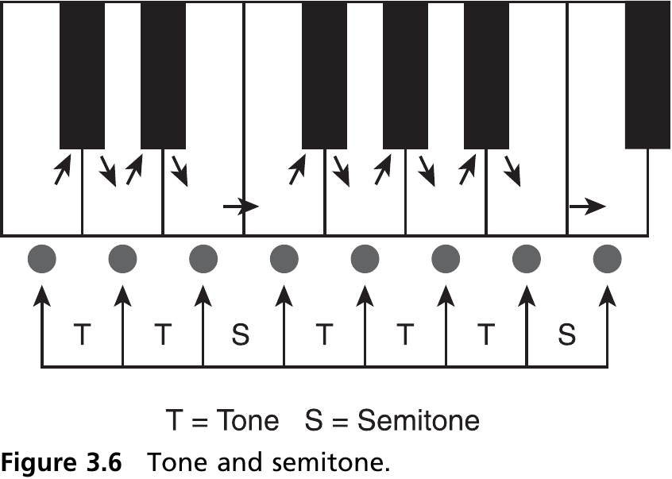

# 第6章 Interval（音程）

定义：两个音符（包含）之间音调的距离，或者说 从第1个音符（包含）数到第2个音符（包含）需要数多少。  
比如从C到G一共有 C D E F G共5个音符，那么C到G的音程就叫做Fifth。  
具体请参考本书第65页（PDF #82）的图6.3。  
当两个音符同时发声时，有些听起来比较顺耳（或者称之为 和谐），称之为 Concords，有些则不顺耳（不和谐），称之为 Discords。  

## Compound Intervals（复合音程）

定义：音程大于1个octave的称之为复合音程，因为这种音程是由1个octave加1个简单音程组合而来的。  

# 第7章 Meter（节拍）

Meter is a recurring pattern of stresses or accents that provide the pulse or beat of music.  
1 metric cycle / measure / bar译为”1小节”。  

## Time Signatures（节拍记号）

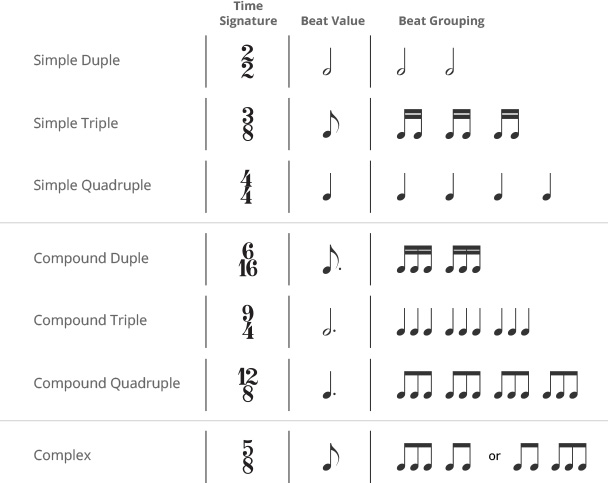  
比如 $\frac{3}{4}$ 意为：4分音符为1拍，每个小结有3拍。

## Syncopation（切分音）

大致就是：在弱拍的时候演奏本来在强拍的音符。  
如果重复的使用这种技巧的话，听众就会适应这种效果。  

## Rhythmic Motives（用节奏当作动机）

Rhythmic Motives is a short, identifiable unit of rhythm.  
有些曲风会使用特定的节奏动机，按照那样的动机来谱曲能帮助你写出那样曲风。

## Tuplet（连音符）

比较常见的为Triplet（三连音符）
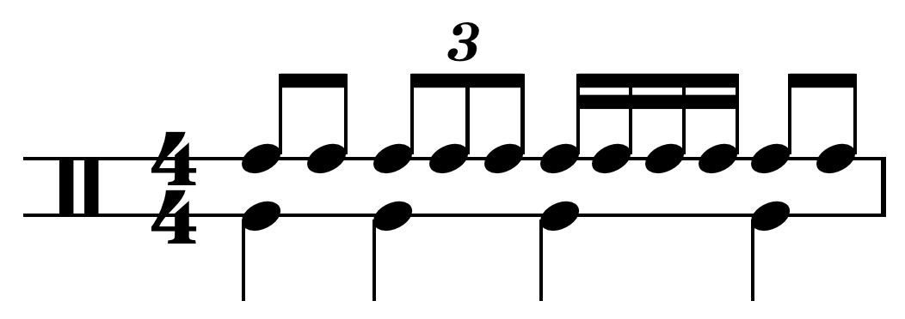
三连音也可以用来创造动机，而且也能让音乐变得多样化（variety）一些。

## Shuffle Rhythm

也叫做 Swing，最开始起源于爵士乐。
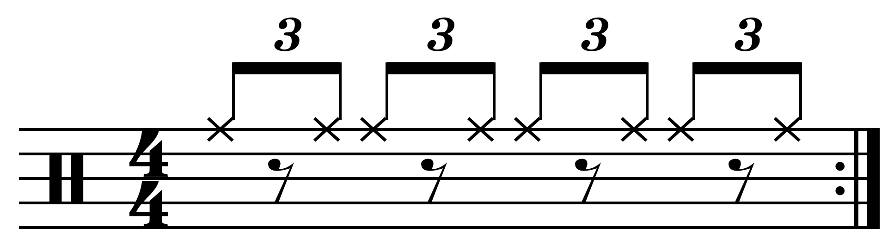
Shuffle Rhythm 音乐例子  
[Cross-rhythm sample I](https://www.youtube.com/watch?v=WEsD11wFb6g)

# 第8章 Chords（和弦）

和弦都是由多个音程构成的。 / Chords are made up of intervals.  
两个音符所发出的声音的频率的比例越简单（比如 1:2就是一个音符和一个高8度的音符的比例），听起来越顺耳。  
两个音符同时发声的时候，都会产生和声（或者说 根音+泛音（Overtone）），两个音符的和声相同的地方越多，两个音符混合的效果越好。  
因此，有些音程听起来很和谐，称之为Concords，而有些音程听起来不和谐，称之为 Discords。

## Perfect Concords

听起来最和谐的音程就是 Octave，两个音符的频率之间的比例为2:1。因为它俩太和谐了，甚至听起来就像一个音一样。  
和谐程度排第2的是 Perfect Fifth，比例为 3:2。  
和谐程度排第3的是 Perfect Forth，比例为 4:3。

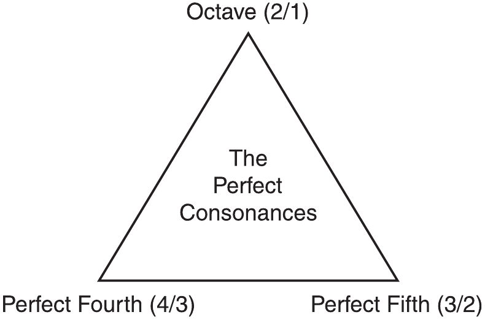

## Imperfect Concords

之所以有些音程被称为 Inperfect Interval，是因为存在两种形式，一个是 Major Interval，一个是 Minor Interval。

### Thirds and Sixths

相比 Perfect Concords，Third 是区分大（Major）小（Minor）的。  
Majro Thrid 包含 4 个 semitone，音符频率比例为 5:4;  
Minor Third 包含 3 个 semitone，音符频率比例为 6:5。  
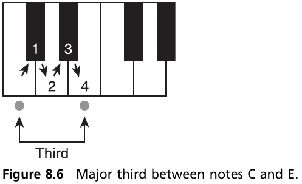
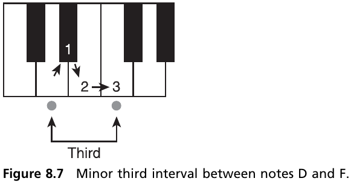

Sixth 也区分大小。  
Major Sixth 包含 9 个 semitone，音符频率比例为 5:3;  
Minor Sixth 包含 8 个 semitone，音符频率比例为 8:5。  
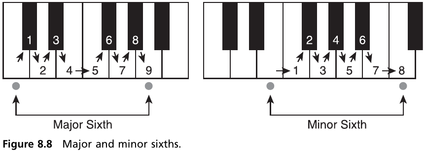

相比之下，Thirds 和 Sixths 音程的频率比例也算比较简单，所以听起来也挺和谐的。

### Seconds and Sevenths

相比之下，Seconds 和 Sevenths 就比较不太和谐了，是因为它们的音程的频率比例在数学上比较打架。  
这两种音程都被称之为 Discords。  

Major Second 包含 2 个 semitone，Minor Second 包含 1 个 semitone。  
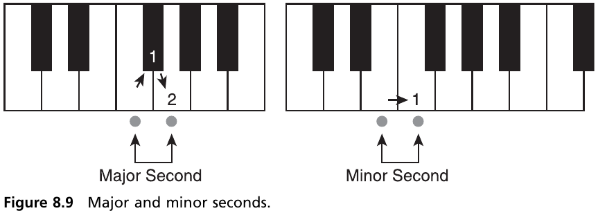
Minor Second 比 Major Second 听起来更不和谐一些。

Major Seventh 包含 11 个 semitone，Minor Seventh 包含 10 个 semitone。  
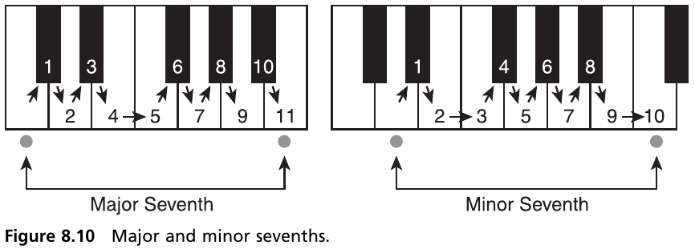
Major Seventh 比 Minor Seventh 听起来更不和谐一些。  

## 音程的类型（Types of Intervals）

因为爵士（Jazz）和声全都是 Sevenths 和 Ninths，这两种音程都是不和谐的音程。但因为爵士乐里都是这种音程，所以人耳就接受它了。因此，一个音程是和谐还是不和谐，不是绝对的。

Perfect Intervals 和 Imperfect Inetrvals 的区别体现在他们的用法上。  
Perfect Intervals 用来给和弦提供一个稳定的背景结构（stable background structure），Imperfect Intervals 用来决定这个和弦是 Majro 还是 Minor。

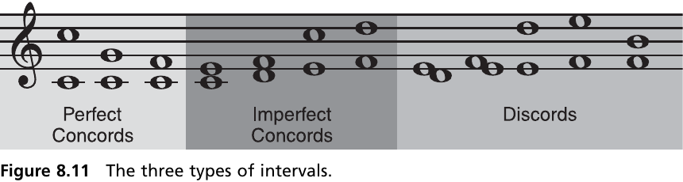

| Interval | Mode      | Type      | Quality         | Semitones |
| -------- | --------- | --------- | --------------- | --------- |
| First    | Perfect   | Perfect   | Perfect concord | 0         |
| Second   | Imperfect | Minor     | Discord (sharp) | 1         |
| Second   | Imperfect | Major     | Discord (mild)  | 2         |
| Third    | Imperfect | Minor     | Concord         | 3         |
| Third    | Imperfect | Major     | Concord         | 4         |
| Forth    | Perfect   | Perfect   | Perfect concord | 5         |
| Forth    | Chromatic | Augmented | Discord (sharp) | 6         |
| Fifth    | Perfect   | Perfect   | Perfect concord | 7         |
| Sixth    | Imperfect | Minor     | Concord         | 8         |
| Sixth    | Imperfect | Major     | Concord         | 9         |
| Seventh  | Imperfect | Minor     | Discord (mild)  | 10        |
| Seventh  | Imperfect | Major     | Discord (sharp) | 11        |
| Octave   | Perfect   | Perfect   | Perfect concord | 12        |

## Triadic Harmony

和弦的性质是从根音算起的。  
Root - Major Third 和 Root - Perfect Fifth 构成的就是 Major Chord;  
Root - Minor Thrid 和 Root - Perfect Fifth 构成的就是 Minor Chord。

## Triads in the C Major Scale

以 C Majro 和弦举例。  
C (Root) + E (Third) + G (Fifth)  
和弦里最重要的音就是根音，也叫 Root，整个和弦都在这个基础上构建。

## Chordal Functions

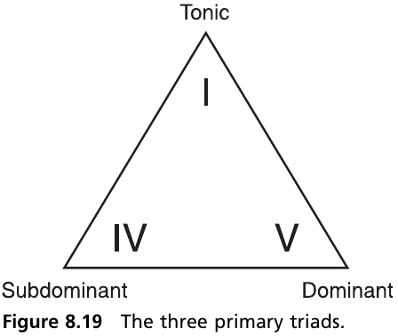

# 第9章 The Natural Minor Scale（自然小调）
