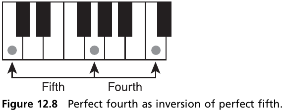
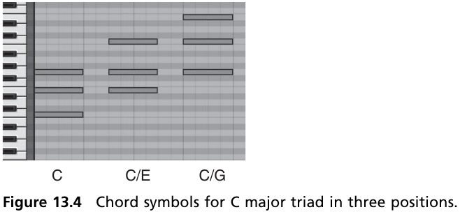
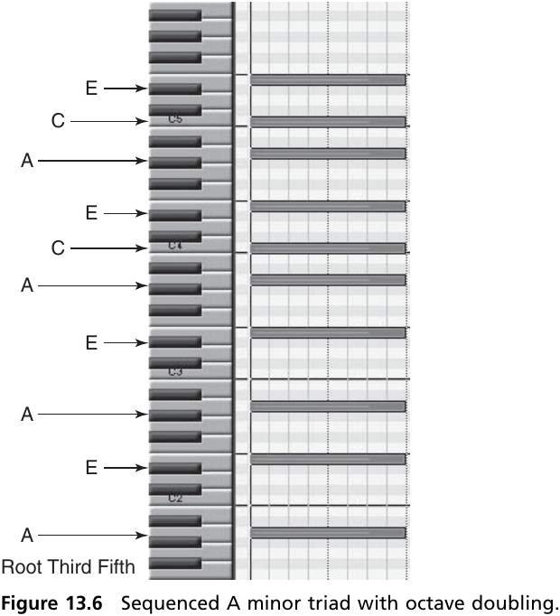
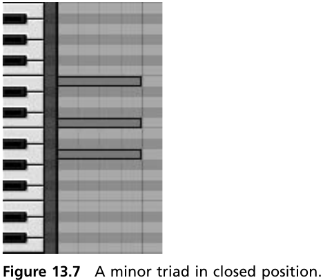
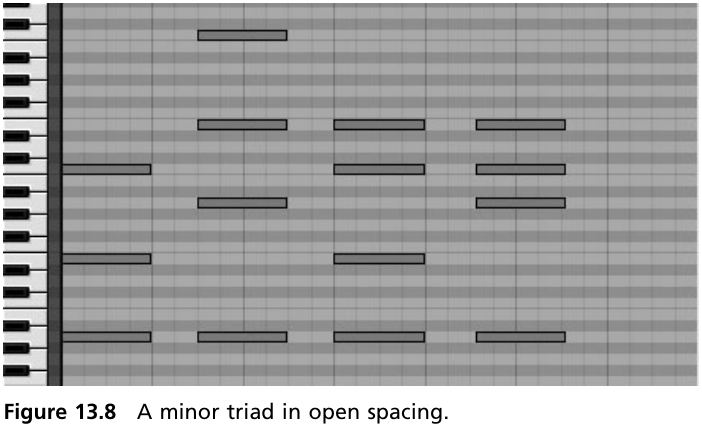
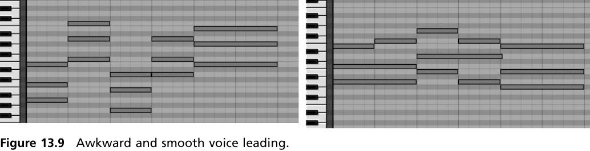

# Music Theory for Computer Musicians Notes

# 第1章 音乐

音乐三大要素：

1. 音色（Tone Quality or Timbre）
2. 音调（Pitch）
3. 音量（Amplitude or Intensity）

# 第2章 The Notes

上图中：

1. Db后面的 b 称之为 flat，b意味着该键是通过把D降低半音得到的，全称叫 “D flat”，也可以记作 “Db”。其它的 Eb Gb Ab Bb 也是如此。
2. C# 后面的 # 称之为 sharp，# 意味着该键是把 C 升高半音得到的，全程叫 “C sharp”，也可以记作”C#”。其它的 D# F# G# A# 也是如此。
3. 在每个调式（Scale）内，每个字母只允许出现一次，也就是不可能同时出现 C C# D 这样的情况。

# 第3章 Major Scale

## Scale（调式）的种类

Majro Scale, Minor Scale, Chromatic Scale 常见于西方经典以及流行乐曲里。
Pentatonic Scale 常见于 folk 和舞曲里。
Microtonal Scales 常见于近远西方。
Modal Scales 常见于folk、popular、experimental rock和 dance 音乐。
Octatonic Scale 和 Hexatonic Scale 常被用作 Major Scale 和 Minor Scale 的变种，
Exotic Scales （外来调式）也经常用于创作出不寻常的气氛的音乐。

## Key（根音）

Key在一个Scale的起始位置。比如 do re mi fa so la ti 里的 do 就是这个scale的key。

## Scale （调式）

  
根音从C开始，C D E F G A B C就是 Major Scale了。

## Interval（音程）

音程是两个音符之间的音调上的距离。  
键盘上的每个键（包括白键和黑键）之间的间隔为 Semitone（半音）。  
一个Octave（八度）里包含12个Semitone。  
2 Semitones = 1 Tone（全音）  

# 第6章 Interval（音程）

定义：两个音符（包含）之间音调的距离，或者说 从第1个音符（包含）数到第2个音符（包含）需要数多少。  
比如从C到G一共有 C D E F G共5个音符，那么C到G的音程就叫做Fifth。  
具体请参考本书第65页（PDF #82）的图6.3。

当两个音符同时发声时，有些听起来比较顺耳（或者称之为 和谐），称之为 Concords，有些则不顺耳（不和谐），称之为 Discords。  

## Compound Intervals（复合音程）

定义：音程大于1个octave的称之为复合音程，因为这种音程是由1个octave加1个简单音程组合而来的。  

# 第7章 Meter（节拍）

Meter is a recurring pattern of stresses or accents that provide the pulse or beat of music.  
1 metric cycle / measure / bar译为”1小节”。  

## Time Signatures（节拍记号）

  
比如 $\frac{3}{4}$ 意为：4分音符为1拍，每个小结有3拍。

## Syncopation（切分音）

大致就是：在弱拍的时候演奏本来在强拍的音符。  
如果重复的使用这种技巧的话，听众就会适应这种效果。  

## Rhythmic Motives（用节奏当作动机）

Rhythmic Motives is a short, identifiable unit of rhythm.  
有些曲风会使用特定的节奏动机，按照那样的动机来谱曲能帮助你写出那样曲风。

## Tuplet（连音符）

比较常见的为Triplet（三连音符）  
  
三连音也可以用来创造动机，而且也能让音乐变得多样化（variety）一些。

## Shuffle Rhythm

也叫做 Swing，最开始起源于爵士乐。  
  
Shuffle Rhythm 音乐例子  
[Cross-rhythm sample I](https://www.youtube.com/watch?v=WEsD11wFb6g)

# 第8章 Chords（和弦）

和弦都是由多个音程构成的。 / Chords are made up of intervals.  
两个音符所发出的声音的频率的比例越简单（比如 1:2就是一个音符和一个高8度的音符的比例），听起来越顺耳。  
两个音符同时发声的时候，都会产生和声（或者说 根音+泛音（Overtone）），两个音符的和声相同的地方越多，两个音符混合的效果越好。  
因此，有些音程听起来很和谐，称之为Concords，而有些音程听起来不和谐，称之为 Discords。

## 和弦的构成

一个和弦最少由3个音符堆叠起来，每个相邻音符之间的间距是个 3rd（3度，无论是 Major 3rd 还是 Minor 3rd）。  
*由两个音程为5度的音符构成的和弦称之为 Power chord，该和弦不在本章的讨论范围内。*

根音（也就是和弦的最低音）决定了这个和弦的身份（Identity），根音与其它音的音程决定了这个和先的味道（Flavour）。

## Perfect Concords

听起来最和谐的音程就是 Octave，两个音符的频率之间的比例为2:1。因为它俩太和谐了，甚至听起来就像一个音一样。  
和谐程度排第2的是 Perfect Fifth，比例为 3:2。  
和谐程度排第3的是 Perfect Forth，比例为 4:3。

## Imperfect Concords

之所以有些音程被称为 Inperfect Interval，是因为存在两种形式，一个是 Major Interval，一个是 Minor Interval。

### Thirds and Sixths

相比 Perfect Concords，Third 是区分大（Major）小（Minor）的。  
Majro Thrid 包含 4 个 semitone，音符频率比例为 5:4;  
Minor Third 包含 3 个 semitone，音符频率比例为 6:5。  

Sixth 也区分大小。  
Major Sixth 包含 9 个 semitone，音符频率比例为 5:3;  
Minor Sixth 包含 8 个 semitone，音符频率比例为 8:5。  

相比之下，Thirds 和 Sixths 音程的频率比例也算比较简单，所以听起来也挺和谐的。

### Seconds and Sevenths

相比之下，Seconds 和 Sevenths 就比较不太和谐了，是因为它们的音程的频率比例在数学上比较打架。  
这两种音程都被称之为 Discords。  

Major Second 包含 2 个 semitone，Minor Second 包含 1 个 semitone。  
  
Minor Second 比 Major Second 听起来更不和谐一些。

Major Seventh 包含 11 个 semitone，Minor Seventh 包含 10 个 semitone。  
  
Major Seventh 比 Minor Seventh 听起来更不和谐一些。  

## 音程的类型（Types of Intervals）

因为爵士（Jazz）和声全都是 Sevenths 和 Ninths，这两种音程都是不和谐的音程。但因为爵士乐里都是这种音程，所以人耳就接受它了。因此，一个音程是和谐还是不和谐，不是绝对的。

Perfect Intervals 和 Imperfect Inetrvals 的区别体现在他们的用法上。  
Perfect Intervals 用来给和弦提供一个稳定的背景结构（stable background structure），Imperfect Intervals 用来决定这个和弦是 Majro 还是 Minor。

| Interval | Mode      | Type      | Quality         | Semitones |
| -------- | --------- | --------- | --------------- | --------- |
| First    | Perfect   | Perfect   | Perfect concord | 0         |
| Second   | Imperfect | Minor     | Discord (sharp) | 1         |
| Second   | Imperfect | Major     | Discord (mild)  | 2         |
| Third    | Imperfect | Minor     | Concord         | 3         |
| Third    | Imperfect | Major     | Concord         | 4         |
| Forth    | Perfect   | Perfect   | Perfect concord | 5         |
| Forth    | Chromatic | Augmented | Discord (sharp) | 6         |
| Fifth    | Perfect   | Perfect   | Perfect concord | 7         |
| Sixth    | Imperfect | Minor     | Concord         | 8         |
| Sixth    | Imperfect | Major     | Concord         | 9         |
| Seventh  | Imperfect | Minor     | Discord (mild)  | 10        |
| Seventh  | Imperfect | Major     | Discord (sharp) | 11        |
| Octave   | Perfect   | Perfect   | Perfect concord | 12        |

## Triadic Harmony

和弦的性质是从根音算起的。  
Root - Major Third 和 Root - Perfect Fifth 构成的就是 Major Chord;  
Root - Minor Thrid 和 Root - Perfect Fifth 构成的就是 Minor Chord。

## Triads in the C Major Scale

以 C Majro 和弦举例。  
C (Root) + E (Third) + G (Fifth)  
和弦里最重要的音就是根音，也叫 Root，整个和弦都在这个基础上构建。

## Chordal Functions

# 第9章 The Natural Minor Scale（自然小调）

（本章内容都会，所以没有笔记）

# 第10章 Melody and Motives（旋律和动机）

## 动机（Motives）

All memorable tunes are made up of recognizable motives.  
所有令人难忘的（或者说 在脑海里挥之不去的）音调都是由高辨识度的动机组成的。

A motive is simply a short snippet of melody that is readily recognizable to the ear because of its distinctive rhythm.  
动机其实就是由一小段旋律构成的，因为这段旋律的节奏很独特，所以很容易被耳朵辨识。

Whatever tunes you write, if they are to be memorable, they will be built up from motives.  
无论你要写什么曲调，如果想让它听起来令人难忘的话，就应该先从动机开始写。

Motive generally employ 2 or 3 notes played with a strong, readily identifiable rhythm.  
动机一般是由2或3个音符构成的，并且带有在强烈的、易区分的节奏。

Motives are usually the building blocks of a greater structure.  
动机（差不多）就是更大的乐段的积木。

## 写个强烈的动机（Writing a Strong Motive）

To write a good motive, work on the rhythm first. Create a strong, distinctive rhythm that the ear will immediately recognize.  
想要写个好的动机，首先应该在节奏上做文章。写一个能立即唤起耳朵的、强烈的、独特的节奏。

分析别人的曲子里的动机的时候，可以思考下面几个问题：

1. Why has the writer used this motive?  
    为什么作者用了这个动机?
2. What do the intervals suggest?  
    所用到的音程想表达什么?

# 第11章 The Harmonic and Melodic Minor Scales（和声小调和旋律小调）

小调（Minor Scale）一共有三种形式：

1. 自然小调（Natural Minor Scale）
2. 和声小调（Harmonic Minor Scale）
    7th 音符升高 1 个 semitone
3. 旋律小调（Melodic Minor Scale）
    6th 和 7th 音符升高 1 个 semitone

## 和声小调（Harmonic Minor Scale）

相比自然小调，和声小调的 7th 音符被升高了1个semitone，6th 和 7th 之间就有了一个称之为 Augmented 2nd 音程。  
这样做的原因是 V 和弦就由原来的 minor chord变成了 majro chord。
很久以前，一些音乐家觉得 V - i 和弦进程比 v - i 更具有说服力，因为 V 和弦里所有的音都能平滑的过渡到 i 和弦。

自然小调的 v - i 和弦进程听起来比较柔和、安静; 旋律小调的 V - i 和弦进程听起来更强劲有力，也有更强的终结了的感觉。

## 旋律小调（Melodic Minor Scale）

还是很久以前的音乐家觉得和声小调的 7th 音符升高 1 个 semitone 后，觉得还是听起来不爽，于是又把 6th 音符升高了 1 个 semitone，于是就形成了旋律小调。
旋律小调与大调的唯一区别就是 旋律小调的 3rd 音符比大调低 1 个 semitone。  
为了抵消（counterbalance）这种大调的感觉，
旋律小调的上行结构（从低音往高音弹奏）是 6th 和 7th 升高 1 个 semitone，
下行结构（从高音往低音弹奏）是和自然小调一样的。

# 第12章 Augmented and Diminished Interval and Interval Inversions（增音程和减音程以及音程转位）

## Augmented and Diminished Intervals（增音程和减音程）

$Diminished \xleftrightarrow{\text{semitone}} Minor \xleftrightarrow{\text{semitone}} Major \xleftrightarrow{\text{semitone}} Augmented$  
$Diminished \xleftrightarrow{\text{semitone}} Perfect \xleftrightarrow{\text{semitone}} Augmented$

## Interval Inversions（音程转位）

# 第13章 Chordal Inversions, Octave Doubling, and Spacing

## Harmony（和声）

Triads 是构成和弦的基本元素，它包含3个音符：Root（根音）, Third（3度）, Fifth（5度）。  
比如 C Major 和弦就包含 C（Root）-E(Thrid)-G(Fifth)。

Root 是很重要的一个音，它代表着一个和弦的身份。比如 C Major 和弦就是以 Root C 命名的。  
第2重要的音符是 Fifth，它和 Root 构成了一个和弦的骨架。  
第3重要的音符是 Third，它与根音的音程决定了和弦的性质，是 Majro 还是 Minor。

## Inverted Chords（和弦转位）

Inverted chords occur when a note other thant the root occurs in the bass.  
当和弦的最低音不是根音的时候，这个和弦称之为 转位和弦。

转位后的和弦因为根音不再是原来的根音了，也就意味着新的根音和其它音符的音程有所变化，所以和弦的味道会有些变化。

## Octave Doubling

  
具体哪个音该不该 doubling，请阅读 "Harmony for Computer Musicians"。

## Spacing

使用音程转位和和弦转位来实现 Chordal Spacing。

  

  
Chordal Spacing 能让和弦进程听起来更平稳（Smooth）。  
~~在经典和声学中，这种音符间平滑过度称之为 Voice Leading。~~  
> Voice leading is the term used to describe the linear progression of melodic lines (voices) and their interaction with one another to create harmonies.  
> Voice leading: 线性进行的多条旋律（也就是 Voices）之间的相互作用来创造和声。  
> [Voice leading - wikipedia.org](https://en.wikipedia.org/wiki/Voice_leading)

# 第14章 Additive Rhythms

## Additive & Divisive Rhythm

> For example, 4 may be evenly divided by 2 or reached by adding 2 + 2. In contrast, 5 is only evenly divisible by 5 and 1 and may be reached by adding 2 or 3. Thus, $\frac{4}{8}$ (or, more commonly, $\frac{2}{4}$) is divisive while $\frac{5}{8}$ is additive.  
> 比如, 4 可以被2整除或者可以分解成 2 + 2。一般情况下，5只能被5和1整除，并且可以分解成 2 + 3。因此，$\frac{4}{8}$(或者说更常见的形式 $\frac{2}{4}$)是 Divisive rhythm，而 $\frac{5}{8}$ 是 Additive rhythm.  
> [Additive rhythm and divisive rhythm - wikipedia.org](https://en.wikipedia.org/wiki/Additive_rhythm_and_divisive_rhythm)

## Polyrhythm

两个不同的节拍一起演奏，并且听起来还不错的。  
有时候，这两种节拍的第一拍总会在某个时刻重合。

[Additive Rhythm & Polyrhythm in Ableton Live 9 - youtube.com](https://www.youtube.com/watch?v=dGEuLcidn6Y)

# 第15章 Expanding Your Knowledge of Keys

（本章内容都会，所以没有笔记）

# 第16章 The Pentatonic Scale

Penta: 5个的  
Pentatonic: 5声音阶的

Pentatonic Scale 里去掉了7音阶Scale的第4个音和第7个音，也就是只剩下 1 2 3 5 6 这5个音。  
因为没有了 4 和 7，这5个音按同时按下也能听起来很和谐，所以经常用来教孩子学音乐。

# 第17章 Major, Minor, Augmented, and Diminished Triads

（本章节开头部分先讲解了一下 Major 和 Minor traid，都是前面学过的内容。）

## The Diminished Traid

Diminished chord（减和弦） 就是 minor 3rd + minor 3rd。比如 C Major scale 的 Bdim 和弦就是 Diminished traid。  
因为该和和弦是由两个 minor 3rd 组成的，所以听起来会特别不和谐。

## The Augmented Traid

Augmented chord（增和弦） 就是 major 3rd + major 3rd。
因为根音到 5th 的音程是 Augmented 5th，所以听起来也会很不和谐。  
该和弦具体会在 Chapter#21 和 Chapter #22 学到。

# 第18章 Chord Progressions and Root Movement

## Root Movement

Root movement 对于一段和弦进程是很重要的，回想一下和弦那章提到的: 根音决定了和弦的身份。  
一个和弦及其转位后的和弦所构成的和弦进程不算和弦进程，因为没有产生 Root Movement，无论转位后的低音是如何变化的。

Root movement is subject to definite principles.  
根音的变化受限于有限的一些的原则。

Root Movement 一共有3种：4th, 3rd, 2nd。

## Root Movement by Forths

比如 G $\rightarrow$ Dm 就是 Falling Forths，G $\rightarrow$ C 就是 Rising Forths。  
Root movement by forths is the strongest kind of root movement, and it is often use sequentially, such as in a circle of forths.  
这种 movement 能让和弦之间产生很强烈的对比度。

## Root Movement by Thirds

这种 movement 会导致两个和弦之间有2个音符是相同的，这会让和弦进程过度起来很平滑。  
因为过渡很平滑，所以就不会有 Root Movement by Forths 那样强烈的对比度。

## Root Movement by Seconds

两个和弦之间没有任何音符是相同的，因此这种过渡并不是很平缓，而且还会产生最强的对比度。

在后面的章节里（第23章: 复杂和声（Complex Harmony））会提到，当和弦变得浓厚和复杂时，一组强烈的 root movement 能更容易让耳朵抓住那种感觉。

# 第19章 The Cycle of Fifths（5度圈）
